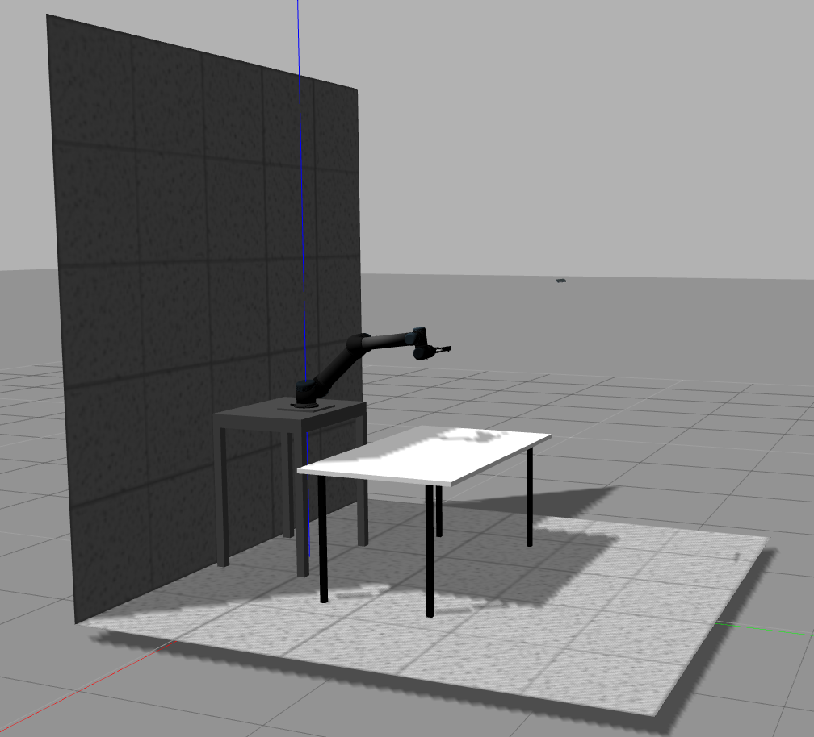

# APCLab Wikis
This code base is a ROS catkin\_workspace being tested under `ROS Indigo + Ubuntu 14.04` development environment. It has known compatibility issues with ROS Kinetics inherited from [ur_modern_driver](https://github.com/ThomasTimm/ur_modern_driver.git). This workspace including the following packages:

## Hardware Drivers:
  - [ur_modern_driver](https://github.com/ThomasTimm/ur_modern_driver.git) (dependent on universal_robot)
  - [arg2f_driver](src/hardware_drivers/arg2f_driver)
  - [universal_robot (indigo)](https://github.com/ros-industrial/universal_robot.git)

## Gazebo Packages

- [Main Package: apclab_gazebo](src/apclab_gazebo)

- [Gazebo Models](src/gazebo_models):
  - armbot_description
  - arg2f_description

- [Gazebo Controllers](src/gazebo_controllers):
  - armbot_gazebo
  - arg2f_gazebo
