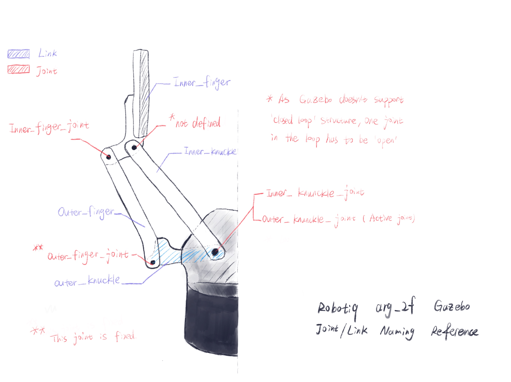

# APCLab Gazebo Models

## [ARG2f-Gripper](arg2f_description)
This package is modified based on the **robotiq_arg2f_model_visualization** package from official [Robotiq ROS Repo](https://github.com/ros-industrial/robotiq.git)offers Gazebo simulation for arg2f_140 gripper. The original official package lacks of Gazebo compatibility, it only launches a model in RVIZ. The modified package includes gazebo colour profile, gazebo controller and updated urdf profile.

The launch file in this package launches one arg2f_140 gripper in empty world with a dummy gazebo controller.

```roslaunch arg2f_gzebo arg2f_140.launch```

Outer\_knuckle\_joint limit in Gazebo Controller:
- Fully closed: 0.77 rads
- Fully open: 0 rads

### Limitation of This Package
 'parent\_link-joint-child\_link_ structure' results in an inherent limitation of ROS urdf language: its inability of  representing ‘closed-loop mechanism’, like a parallelogram that requires _joint-joint_ connection. **The 'not_ defied_' joint in the figure below is left open**.

 As a result, **the basic joint position controller in this package exposes all the revolute joints**. To open/close this gripper as the actual hardware with the dummy controller, multiple joint positions have to be strictly synchronised with specific restrictions. Links will fall apart otherwise. A wrapper will be provided in a future update.

 An example script that utilises this dummy controller is provided in (apclab_dev/src/apclab_gazebo_models   /arg2f_gazebo/scripts/arg2f_manual_control.py).


### Gazebo model Joint/Link Naming Convention:
This naming convention used in the urdf file and controller.



## [Armbot](armbot_description)
This package mounts arg2f_140 gripper on the the tool joint a ur5 in Gazebo.
