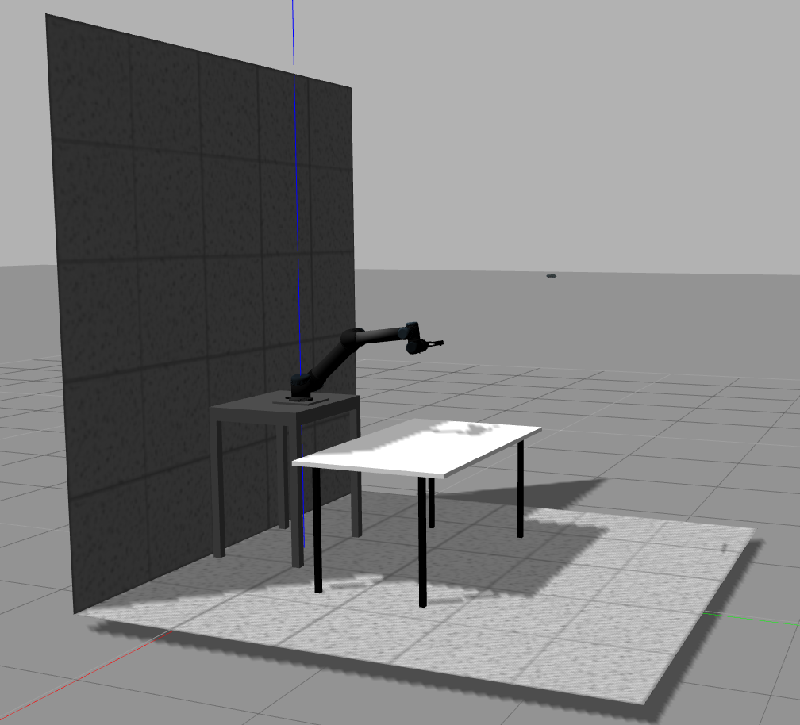
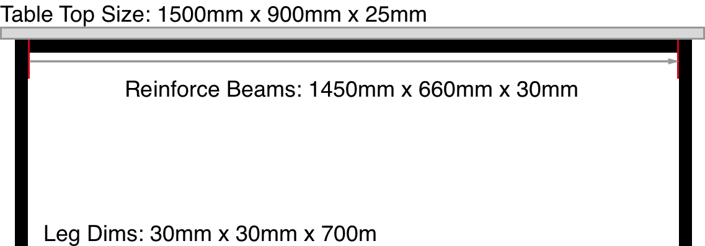
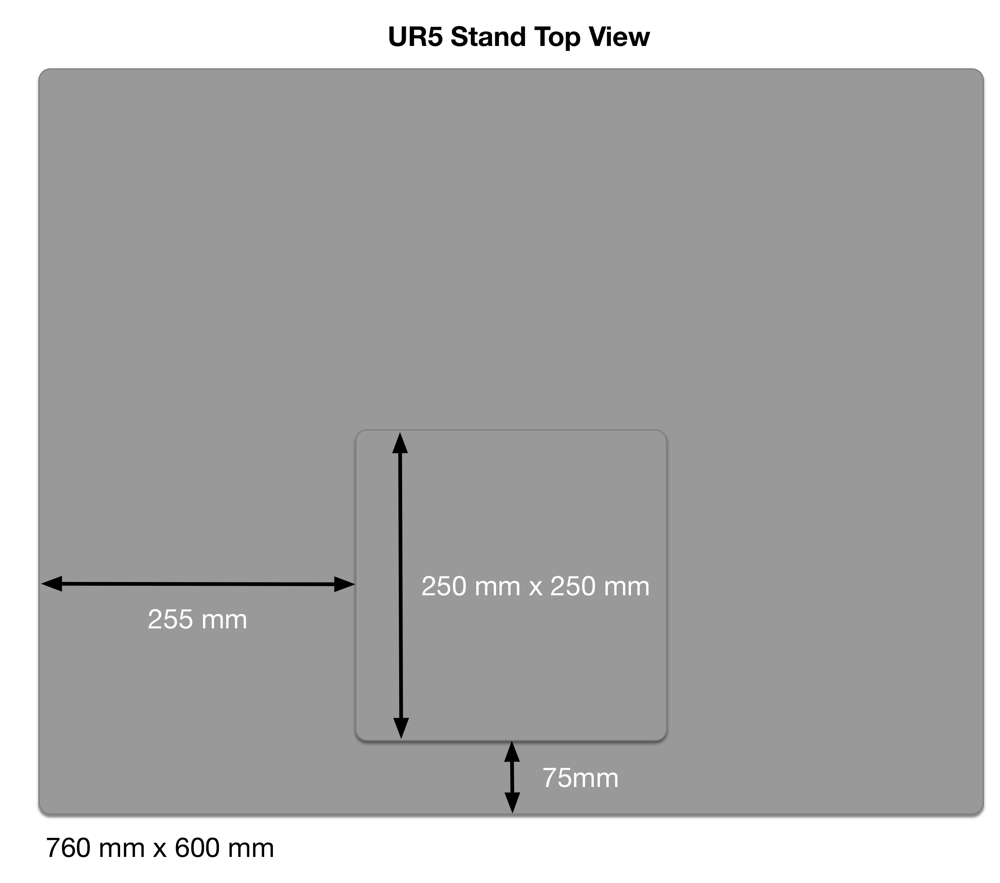
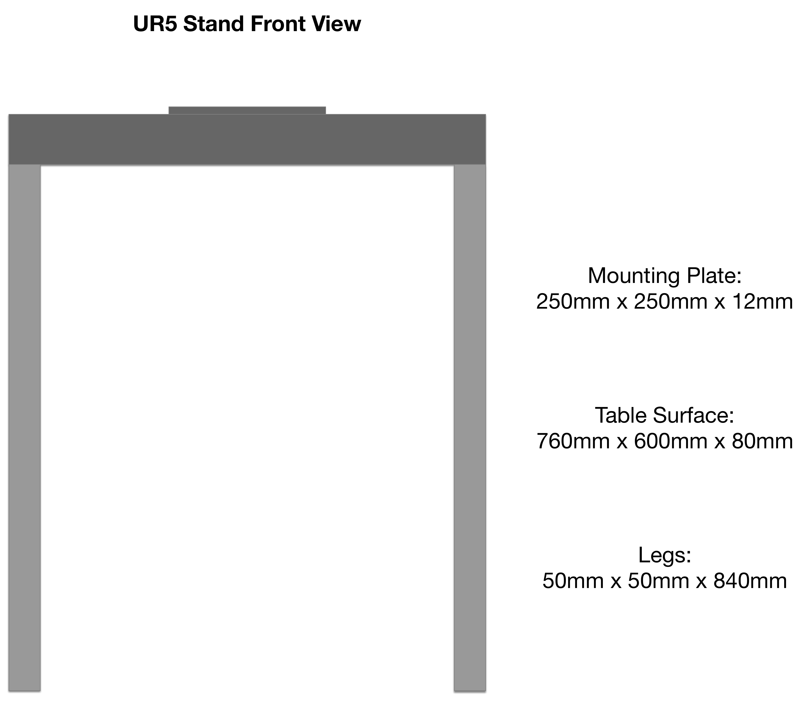

# UR5 Simulation Setup
This package defines the APCLab Gazebo Simulator.

The launch file launches the APCLab Simulator and corresponding simulated hardware controllers.

```roslaunch apclab_gazebo apclab.launch```

## Lab Environment Setup
This section specifies the arrangement in a 2D X-Y plane.
### Lab Equipments
- **Operation Table**: Table holds manipulative objects, including blocks, cups, and etc.
- **UR5 Stand**: (including UR5 Mounting Plate): Aluminium stand for mounting UR5 robot arm.
- **Arg2f-Gripper**: Robotiq 2-finger gripper mounted on the tool joint of UR5 arm
- **RealSense Camera**: RealSense R200 laser depth camera


### Equipments Arrangement:



The 'centre' used below refers to geometrical centre of a rectangle

- The Origin of X-Y plane is aligned with UR5 Base link cylindrical axis, i.e. the centre of mounting plate
- UR5 Stand: (0, - 100) mm
- Operation Table: (0, 700) mm
- Camera: (0, 1600, 1700) mm Looking downwards 30 Degrees, native resolution is 256x256

## Dimensions and Specifications
Following Gazebo models are defined in separate scripts in urdf folder.

### Operation Table:
- Operation Table : 1500mm x 900mm x 725mm




### UR5 Stand

UR5 Stand Top View:



UR5 Stand Front View:


